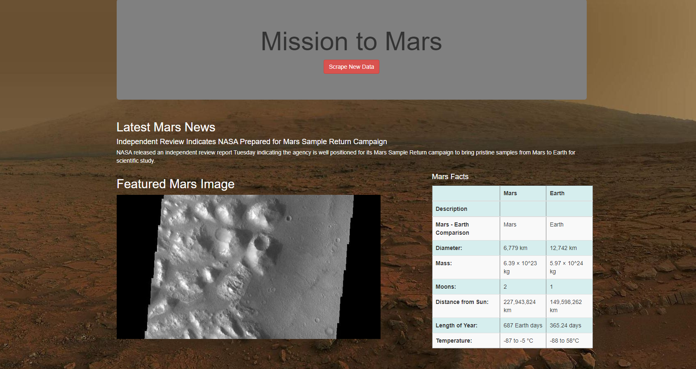
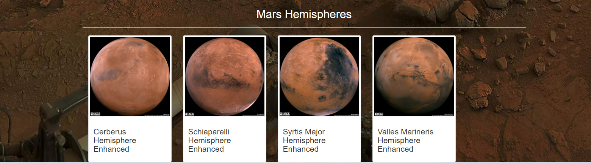

# Mission-to-Mars
### Module 10 Web Scraping!

## Overview of the Analysis:
Robin's web looks good but she wants more information and more images from Mar's hemispheres online and
wanted me to help her on this task. 
  - Need to scrape full-resolution images of Mar's hemispheres and titles of those images
  - Need to scrape data on a Mongo database
  - Need to use a web application to display the data and alter the design of the web app

### Result after everything is done and a little of polish
#### My web app looks like:

